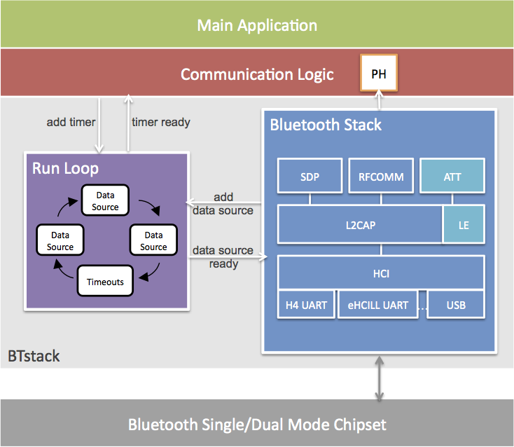

As well as any other communication stack, BTstack is a collection of
state machines that interact with each other. There is one or more state
machines for each protocol and service that it implements. The rest of
the architecture follows these fundamental design guidelines:

-   *Single threaded design* - BTstack does not use or require
    multi-threading to handle data sources and timers. Instead, it uses
    a single run loop.

-   *No blocking anywhere* - If Bluetooth processing is required, its
    result will be delivered as an event via registered packet handlers.

-   *No artificially limited buffers/pools* - Incoming and outgoing data
    packets are not queued.

-   *Statically bounded memory (optionally)* - The number of maximum
    connections/channels/services can be configured.

Figure {@fig:BTstackArchitecture} shows the general architecture of a
BTstack-based single-threaded application that includes the BTstack run loop. 
The Main Application contains the application logic, e.g., reading a sensor value and
providing it via the Communication Logic as a SPP Server. The
Communication Logic is often modeled as a finite state machine with
events and data coming from either the Main Application or from BTstack
via registered packet handlers (PH). BTstack’s Run Loop is responsible
for providing timers and processing incoming data.

 

 {#fig:BTstackArchitecture}

## Single threaded design

BTstack does not use or require multi-threading. It uses a single run
loop to handle data sources and timers. Data sources represent
communication interfaces like an UART or an USB driver. Timers are used
by BTstack to implement various Bluetooth-related timeouts. For example,
to disconnect a Bluetooth baseband channel without an active L2CAP
channel after 20 seconds. They can also be used to handle periodic
events. During a run loop cycle, the callback functions of all 
registered data sources are called. Then, the callback functions of
timers that are ready are executed.

For adapting BTstack to multi-threaded environments check [here](integration/#adapting-btstack-for-multi-threaded-environments).

## No blocking anywhere

Bluetooth logic is event-driven. Therefore, all BTstack functions are
non-blocking, i.e., all functions that cannot return immediately
implement an asynchronous pattern. If the arguments of a function are
valid, the necessary commands are sent to the Bluetooth chipset and the
function returns with a success value. The actual result is delivered
later as an asynchronous event via registered packet handlers.

If a Bluetooth event triggers longer processing by the application, the
processing should be split into smaller chunks. The packet handler could
then schedule a timer that manages the sequential execution of the
chunks.

## No artificially limited buffers/pools

Incoming and outgoing data packets are not queued. BTstack delivers an
incoming data packet to the application before it receives the next one
from the Bluetooth chipset. Therefore, it relies on the link layer of
the Bluetooth chipset to slow down the remote sender when needed.

Similarly, the application has to adapt its packet generation to the
remote receiver for outgoing data. L2CAP relies on ACL flow control
between sender and receiver. If there are no free ACL buffers in the
Bluetooth module, the application cannot send. For RFCOMM, the mandatory
credit-based flow-control limits the data sending rate additionally. The
application can only send an RFCOMM packet if it has RFCOMM credits.

## Statically bounded memory

BTstack has to keep track of services and active connections on the
various protocol layers. The number of maximum
connections/channels/services can be configured. In addition, the
non-persistent database for remote device names and link keys needs
memory and can be be configured, too. These numbers determine the amount
of static memory allocation.