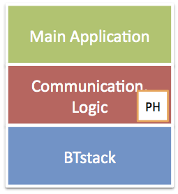
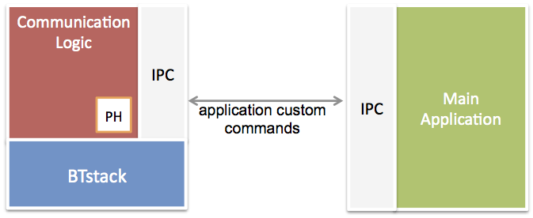
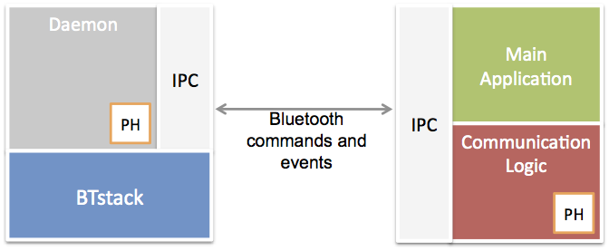

While the run loop provided by BTstack is sufficient for new designs,
BTstack is often used with or added to existing projects. In this case,
the run loop, data sources, and timers may need to be adapted. The
following two sections provides a guideline for single and
multi-threaded environments.

To simplify the discussion, we’ll consider an application split into
“Main ”, “Communication Logic”, and “BTstack”. The Communication Logic
contains the packet handler (PH) that handles all asynchronous events
and data packets from BTstack. The Main Application makes use of the
Communication Logic for its Bluetooth communication.

 

## Adapting BTstack for Single-Threaded Environments

In a single-threaded environment, all application components run on the
same (single) thread and use direct function calls as shown in Figure [below](#fig:BTstackSingle).

BTstack provides a basic run loop that supports the concept of data
sources and timers, which can be registered centrally. This works well
when working with a small MCU and without an operating system. To adapt
to a basic operating system or a different scheduler, BTstack’s run loop
can be implemented based on the functions and mechanism of the existing
system.

Currently, we have two examples for this:

-   *run_loop_cocoa.c* is an implementation for the CoreFoundation
    Framework used in OS X and iOS. All run loop functions are
    implemented in terms of CoreFoundation calls, data sources and
    timers are modeled as CFSockets and CFRunLoopTimer respectively.

-   *run_loop_posix.c* is an implementation for POSIX compliant
    systems. The data sources are modeled as file descriptors and
    managed in a linked list. Then, the*select* function is used to wait
    for the next file descriptor to become ready or timer to expire.

 

## Adapting BTstack for Multi-Threaded Environments

The basic execution model of BTstack is a general while loop. Aside from
interrupt-driven UART and timers, everything happens in sequence. When
using BTstack in a multi-threaded environment, this assumption has to
stay valid - at least with respect to BTstack. For this, there are two
common options:

-   The Communication Logic is implemented on a dedicated BTstack
    thread, and the Main Application communicates with the BTstack
    thread via application-specific messages over an Interprocess
    Communication (IPC). This option results in less code and quick 
    adaption.

    

-   BTstack must be extended to run standalone, i.e, as a Daemon, on a
    dedicated thread and the Main Application controls this daemon via
    BTstack extended HCI command over IPC - this is used for the
    non-embedded version of BTstack e.g., on the iPhone. 
    This option requires more code but provides more flexibility.

    