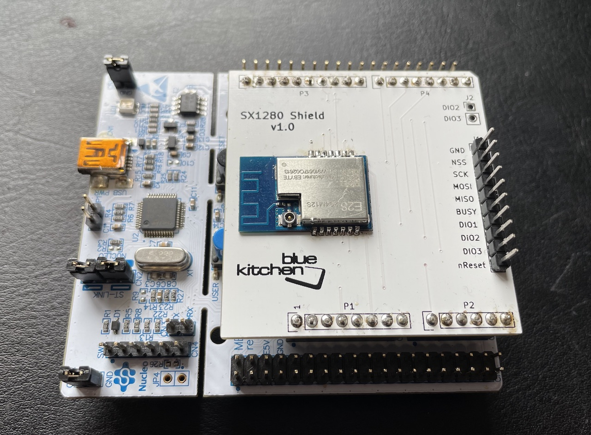

# BTstack port with Cinnamon for Semtech SX1280 2.4 GHz Multi Protocol Controller

*Cinnamon* is BlueKitchen's minimal, yet robust Controller/Link Layer implementation for use with BTstack.

In contrast to common Link Layer implementations, our focus is on a robust and compact implementation for production use,
where code size matters (e.g. current code size about 8 kB).

## Overview

This port targets the Semtech SX1280 radio controller. The Host Stack and the Controller (incl. Link Layer) run on a STM32 MCU, with the SX1280 connected via SPI.

It uses the SX1280 C-Driver from Semtech to communicate with the SX1280. The main modification was to the SPI driver that uses DMA for full packets.

## Status

Tested with the[Miromico FMLR-80-P-STL4E module](https://miromico.ch/portfolio/fmlr-8x-x-stlx/) 
(see port/stm32-l451-miromico-sx1280) and the
[STM32 L476 Nucleo dev kit](https://www.st.com/en/evaluation-tools/nucleo-l476rg.html)
with our [SX1280 Shield](https://github.com/bluekitchen/sx1280-shield). 

SEGGER RTT is used for debug output, so a Segger J-Link programmer is required, but the on-board
[ST-Link programmer and debugger](https://www.st.com/en/development-tools/st-link-v2.html) can be replaced by an
[SEGGER J-Link OB](https://www.segger.com/products/debug-probes/j-link/models/other-j-links/st-link-on-board/). 

Uses 32.768 kHz crytstal as LSE for timing

Support for Broadcast and Peripheral roles.

The Makefile project compiles gatt_counter, gatt_streamer_server, hog_mouse and hog_keyboard examples.

## Limitation

### Advertising State:
- Only Connectable Advertising supported
- Only fixed public BD_ADDR of 33:33:33:33:33:33 is used

### Connection State:
- Encryption not implemented
- Some LL PDUs not supported

### Central Role:
- Not implemented

### Observer Role:
- Not implemented

### Low power mode - basically not implemented:
- MCU does not sleep
- SPI could be disabled during sleep
- 1 ms SysTick is used for host stack although 16-bit tick time is provided by LPTIM1 based on 32768 Hz LSE.

## Getting Started

Just run make. You can upload the EXAMPLE.elf file created in build folder, 
e.g. with Ozone using the provided EXAMPLE.jdebug, and run it.

## TODO

### General
- indicate random address in advertising pdus
- allow to set random BD_ADDR via HCI command and use in Advertisements
- support other regular adv types
- handle Encryption

## Low Power
- enter STANDY_RC mode when idle
- implement MCU sleep (if next wakeup isn't immediate)
- sleep after connection request until first packet from Central
- replace SysTick with tick counter based on LPTIM1
- disable SPI on MCU sleep

